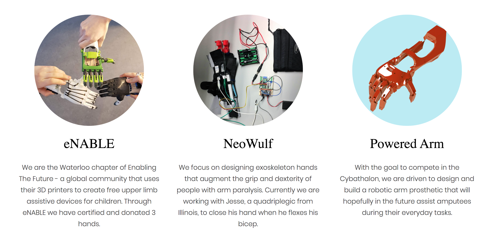

# Biotron_Website
This is the current source code for UWaterloo's Biomechatronics Design Team's official website.

## Our Mission
BioTRON is a University of Waterloo Design Team that focuses on engineering medical prototypes that improve the lives of real users. We aim to give back to our community by donating all our builds to those in need once they are finished. Students from all programs come together on our team to 3D print prosthetic hands for kids, build exoskeleton hands for people with paralysis, or prototype robotic arms.

## Our Projects

## Help Us, Help Others!
If you are a student, feel free to reach out by following our Facebook page for our next meeting details. If you are a company that would be able to sponsor our latest projects please feel free to contact us through email or any other platform. We are always looking for more funding to help us get our builds to those in need as soon as possble!
